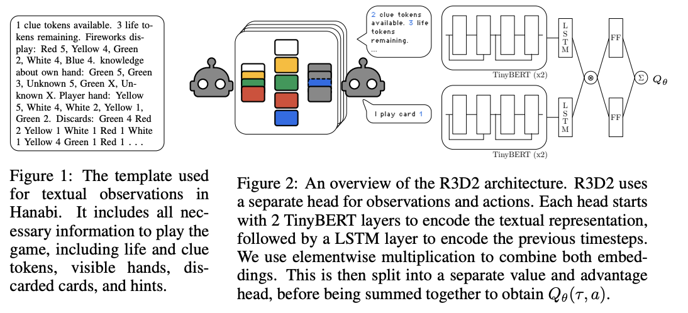

# A Generalist Hanabi Agent - Recurrent Replay Relevance Distributed DQN (R3D2)


## Overview
Recurrent Replay Relevance Distributed DQN (R3D2) is a generalist multi-agent reinforcement learning (MARL) agent designed to play Hanabi across all game settings while adapting to unfamiliar collaborators. Unlike traditional MARL agents that struggle with transferability and cooperation beyond their training setting, R3D2 utilizes language-based reformulation and a distributed learning approach to handle dynamic observation and action spaces. This allows it to generalize across different game configurations and effectively collaborate with diverse algorithmic agents.

## Key Features
- **Generalized MARL agent**: Play Hanabi across different player settings (2-to-5 players) without changing architecture or retraining from scratch.

- **Adaptive cooperation**: Capable of collaborating with unfamiliar partners, overcoming limitations of traditional MARL systems.

- **Language-based task reformulation**: Utilizes text representations to enhance transfer learning and generalization.

- **Distributed Learning Framework**: Employs a scalable MARL algorithm to handle dynamic observations and actions effectively.


## R3D2 Architecture:


The code has been tested with PyTorch 2.0.1


## Get Started

Clone the repo with `--recursive` to include submodules
```bash
git clone --recursive git@github.com:chandar-lab/R3D2-A-Generalist-Hanabi-Agent.git
```

## Table of Contents

- [Environment Setup](#environment-setup)
- [Dependencies](#dependencies)
- [GPU Configuration](#gpu-configuration)
- [Building Tokenizers](#building-tokenizers)
- [Additional Information](#additional-information)
- [Training Scripts R2D2, R3D2](#batch-job-submission-guide)
- [Evaluation Scripts Job](evaluation-job-scrips)


---


## Hanabi Learning Environment Setup

This repository contains the setup instructions for the Hanabi learning environment and related dependencies.


## Environment Setup

1. **Create a Conda environment**:
   ```bash
   conda create --name r3d3_hanabi python=3.9
   ```
2. **Activate the environment**:
   ```bash
   conda activate r3d3_hanabi
   ```

## Dependencies

1. **Install PyTorch (CUDA 11.8)**:
   ```bash
   pip install torch==2.0.1 --index-url https://download.pytorch.org/whl/cu118
   ```
   **For cards only support cuda 12.x:**
   install corresponding nvidia cuda toolkit at first, then:
   ```bash
   pip3 install torch torchvision torchaudio --index-url https://download.pytorch.org/whl/cu128
   ```
   Note that cuda 12.x do not include NVTX anymore, you need to pull manually:
   ```bash
   cd third_party
   git clone https://github.com/NVIDIA/NVTX.git NVTX
   ```
2. **Install pybind11**:
   it's already in project config, at project root, execute:
   ```bash
   git submodule update --init --recursive
   ```

4. **Install Transformers library**:
   ```bash
   pip install transformers==4.31.0
   ```

5. **Install additional Python packages**:
   ```bash
   pip install cmake tabulate cffi psutil
   pip install tdqm scipy matplotlib wandb
   ```

## GPU Configuration   

1. **Install Rust for building tokenizers**:
   ```bash
   curl --proto '=https' --tlsv1.2 -sSf https://sh.rustup.rs | sh
   ```

## Building Tokenizers

1. **Navigate to the `hanabi_lib` directory**:
   ```bash
   cd hanabi-learning-environment/hanabi_lib/
   ```

2. **Clone the `tokenizers-cpp` repository**:
   ```bash
   git clone --recursive git@github.com:mlc-ai/tokenizers-cpp.git
   ```

## Build
   ```bash
   make
   ```

## Building the C++ library:
   ```bash
   rm -rf build
   mkdir build && cd build
   cmake .. -DCMAKE_BUILD_TYPE=Release
   make -j
   ```
   Note that if you face symbol-link errors laster, you could modify CMakeLists.txt at project root:
   ```
   add_compile_definitions(_GLIBCXX_USE_CXX11_ABI=1)
   ```


## Additional Information

- Ensure that all required modules are properly loaded in your environment.
- The setup assumes access to a GPU with CUDA 11.8 support.
- Use `wandb` for experiment tracking and logging during model training.
- If issues arise during the setup, check for compatibility between package versions and your system configuration.

Feel free to contribute or report issues!


## Training R2D2, R3D2
**Note: currently only work for R3D2**

```bash
cd pyhanabi
python r3d2_main.py --config ./configs/r3d2.yaml
```
Also, there are a lot bugs in the repo, please use our branch which fixed most of the issues

## Explanation

- **Seed (`m`)**: The scripts will iterate over the models `a`, `b`, `c`, `d`, and `e`.
- **Player Setting (`p`)**: Jobs will be submitted for player counts of `2`, `3`, `4`, and `5`.
- **Scripts**: The three scripts handle different types of job submissions (`IQL`, `other players`, and `R3D2`).


## Evaluation Scripts Job

```bash
scripts/launch_2p_eval_diff_setting_all.sh
scripts/launch_3p_eval_diff_setting_all.sh
scripts/launch_4p_eval_diff_setting_all.sh
scripts/launch_5p_eval_diff_setting_all.sh

scripts/launch_cross_play.sh


```

## Additional Comments:

`HanabiState::ToText()` converts the game's current state into a human-readable format, providing details on tokens, fireworks, and player hands. [Reference](https://github.com/chandar-lab/Zeroshot_hanabi_instructrl/blob/312366b3038159c8a68476cf44afd0ae609ff26c/hanabi-learning-environment/hanabi_lib/hanabi_state.cc#L393)


This code base is based on  [Language Instructed Reinforcement Learning for Human-AI Coordination (ICML 2023)](https://github.com/hengyuan-hu/instruct-rl).
